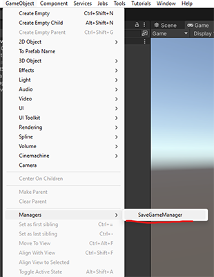
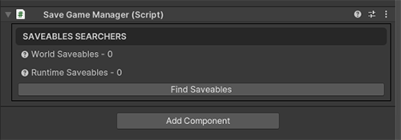

# Sistem de Salvare Modular și Scalabil în Unity

## Introducere
Acest sistem de salvare oferă o balanță între performanță și ușurința de implementare, fiind modular și scalabil. Scopul său este de a permite salvarea și încărcarea datelor din joc, suportând atât date simple (ex. `int`, `float`), cât și date complexe precum liste, dicționare sau structuri de date.

## GetStart
1. Pentru inceput, in mara de meniuri gasiti `Save System` in el este submeniul `Initialize Save Sytem` apasati pentru initializare.
2. Initializarea va crea 2 aseturile necesare la calea: `Resources/Data/`.  <br>
   `SerializationAsset` - este un asset simplu care contine informatii despre numele la fiseire si path unde se vor salva datele.<br>
   `ObjectDataBase` - este un aset mai complex functia principala este sa pastreze referinte la obiectele (`Prefab`) care pot fi salvate. Are un script de editor care creaza o fereastra in care este deajuns sa faceti grag la mapa care contine prefaburile, sau prevaburi aparte. <br>

## Cerințe pentru Implementare
Pentru a folosi sistemul de salvare, este important să înțelegi câteva concepte de bază:

1. **Interfața `ISaveable`**:
   Orice clasă care necesită salvarea datelor trebuie să implementeze această interfață.

2. **Metoda `OnSave`**:
   Trebuie să returneze un obiect de tip `StorableCollection` care are datele pentru salvare in format `[key,value]`, care moștenește de la `Dictionary<string, object>`.

3. **Metoda `OnLoad`**:
   Această metodă primește un obiect de tip `StorableCollection` din care citește informațiile salvate pe baza unui `key`.
4. **Clasa `SaveGameManager`** Din bara de meniu Unity, selectează GameObject -> Manager -> SaveGameManager. Automat, se va crea un `SaveGameManager` în scena activă.
   
5. După ce ai adăugat toate obiectele care pot fi salvate în scenă, selectează `SaveGameManager` din scenă și apasă pe butonul Find Saveable. Acest lucru va seta referințele către toate obiectele care implementează ISaveable.
6. 
## Save And Laod

Pentru a salva sau încărca jocul, trebuie să apelezi metodele statice din clasa SaveGameManager:

   1.**Salvare:** `SaveGameManager.OnSave()`\
   2.**Încărcare:** `SaveGameManager.OnLoad()`

## Exemplu de Cod
Mai jos este un exemplu simplu de clasă care implementează interfața `ISaveable`:

```csharp
using UnityEngine;

public class ExperienceManager : MonoBehaviour, ISaveable
{
    public int level;
    public float experience;
    
    // Metoda OnLoad: Aceasta încarcă datele din colecția de tip StorableCollection.
    public void OnLoad(StorableCollection members)
    {
        // Extragem valoarea corespunzătoare pentru "level" și "experience" pe baza cheii
        level = members.GetT<int>(nameof(level)); 
        experience = members.GetT<float>(nameof(experience)); 
    }

    // Metoda OnSave: Aceasta salvează valorile curente într-un StorableCollection.
    public StorableCollection OnSave()
    {
        // Creăm o nouă colecție de date
        StorableCollection members = new StorableCollection()
        {
            { nameof(level), level },         // Salvăm nivelul unde [nameof(level) - key si level - value]
            { nameof(experience), experience} // Salvăm experiența
        };
        return members; // Returnăm colecția cu datele salvate
    }
}